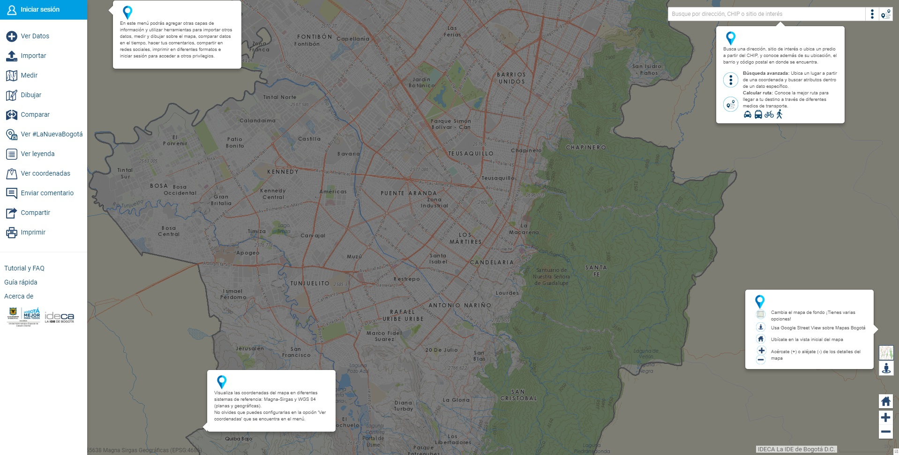
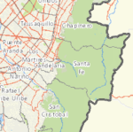
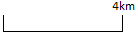

# Herramientas de Navegación

Puedes interactuar con el mapa cambiando el mapa base, ajustando la escala de visualización, realizando panorámicas en 360° o dejando el mapa en un extensión predeterminada.

## Conoce las herramientas de navegación

| **Icono** | **Descripción** |
| ----------- | ----------- |
|  | **Cambiar mapa base:** Cambia el fondo del Mapa por alguna de estas opciones: mapas base híbrido, base gris, topográfico y base tóner. |
|  | **Google Street View:** Recorre la ciudad visualizando imágenes panorámicas a nivel de calle (360° de movimiento horizontal y 290° de movimiento vertical).  Esta funcionalidad está incorporada en Mapas Bogotá, de acuerdo a los Términos y Condiciones de uso de Google Street View. |
|  | **Extensión predeterminada:** Ajusta el Mapa a la visualización inicial predeterminada. |
|  | **Acercar:** Acércate en el mapa, cada vez que das un clic al signo + obtienes la menor escala del mapa. **Aléjate:** en el mapa, cada vez que da un clic al signo - obtienes la mayor escala del mapa. |
|  | **Barra de escala:** Conoce la escala gráfica de visualización actual de la información geográfica sobre el visor. |
|  | **Vista general del Mapa:** Visualiza la extensión actual del mapa en un contexto geográfico más amplio.|

Google Street View: Recorre la ciudad visualizando imágenes panorámicas a nivel de calle (360° de movimiento horizontal y 290° de movimiento vertical).  Esta funcionalidad está incorporada en Mapas Bogotá, de acuerdo a los Términos y Condiciones de uso de Google Street View.